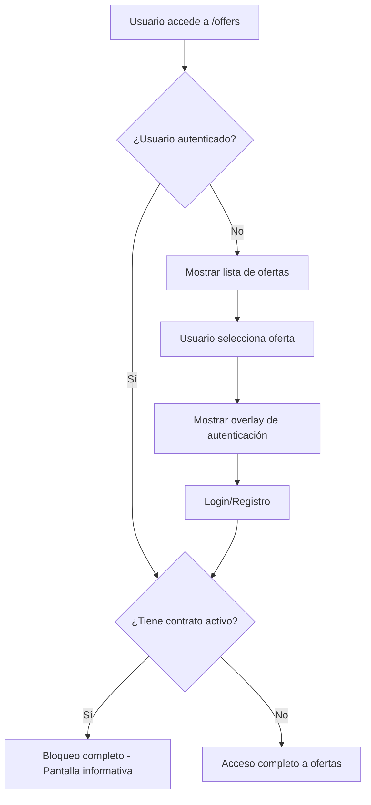

# 🔐 Control de Acceso a Ofertas de Trabajo - Módulo de Seguridad

## 📋 Resumen Ejecutivo

Este documento describe la implementación del **Sistema de Control de Acceso a Ofertas** desarrollado para Andes Workforce, que permite gestionar el acceso a las ofertas de trabajo según el estado del usuario y estrategias de engagement.

---

## 🎯 Objetivos y Requerimientos

### Requerimientos Funcionales
1. **Usuarios con contrato activo** → No pueden ver ofertas (bloqueo completo)
2. **Usuarios no autenticados** → Pueden ver lista pero no detalles (estrategia teaser)
3. **Usuarios autenticados sin contrato** → Acceso completo

### Objetivos de UX
- **Generar curiosidad** sin frustrar al usuario
- **Mejorar conversión** de registro/login
- **Proteger información sensible** de ofertas
- **Evitar conflictos de interés** en usuarios contratados

---

## 🏗️ Arquitectura del Sistema

### Diagrama de Flujo



### Stack Tecnológico
- **Frontend**: Next.js 14, React 18, TypeScript
- **Estado Global**: Zustand
- **Estilos**: Tailwind CSS
- **Comunicación API**: Axios
- **Autenticación**: JWT tokens

---

## 📁 Estructura de Archivos

```
src/app/pages/offers/
├── actions/
│   └── user-status.actions.ts          # Server actions para verificar estado
├── components/
│   ├── OffersAccessGuard.tsx           # Guard principal con React Context
│   └── OfferDetailGuard.tsx            # Guard específico para detalles
├── page.tsx                            # Página principal integrada
└── README_ACCESS_CONTROL.md            # Documentación técnica
```

---

## 🔧 Componentes Implementados

### 1. Server Action - Verificación de Estado

**Archivo**: `user-status.actions.ts`

```typescript
export async function checkUserContractStatus(): Promise<{
  success: boolean;
  data?: UserContractStatus;
  error?: string;
}> {
  try {
    const axiosInstance = await createServerAxios();
    const response = await axiosInstance.get('/users/current-contract');
    
    return {
      success: true,
      data: {
        hasActiveContract: true,
        contractId: response.data.id,
        contractType: response.data.type
      }
    };
  } catch (error: any) {
    if (error.response?.status === 404) {
      // Usuario sin contrato activo
      return {
        success: true,
        data: { hasActiveContract: false }
      };
    }
    
    return {
      success: false,
      error: 'Error al verificar estado del contrato'
    };
  }
}
```

**Funcionalidad**:
- ✅ Consulta endpoint `/users/current-contract`
- ✅ Maneja respuestas 200 (tiene contrato) y 404 (sin contrato)
- ✅ Gestión robusta de errores

### 2. Context Provider - Guard Principal

**Archivo**: `OffersAccessGuard.tsx`

```typescript
interface AccessControlState {
  isAuthenticated: boolean;
  hasActiveContract: boolean;
  isLoading: boolean;
  canViewOffers: boolean;
  canViewDetails: boolean;
}

const AccessControlContext = createContext<AccessControlState | null>(null);

export const OffersAccessGuard: React.FC<{ children: React.ReactNode }> = ({ children }) => {
  // Lógica de verificación de estados
  // Bloqueo completo para usuarios con contrato
  // Acceso parcial para usuarios no autenticados
}
```

**Funcionalidad**:
- ✅ React Context para compartir estado
- ✅ Verificación automática de autenticación
- ✅ Consulta de estado de contrato
- ✅ Estados de carga y error

### 3. Guard de Detalles - Overlay de Autenticación

**Archivo**: `OfferDetailGuard.tsx`

```typescript
const OfferDetailGuard: React.FC<{ children: React.ReactNode }> = ({ children }) => {
  const { canViewDetails, isAuthenticated } = useAccessControl();

  if (!canViewDetails) {
    return (
      <div className="relative w-full h-full min-h-[800px]">
        {/* Contenido borroso */}
        <div className="absolute inset-0 filter blur-lg pointer-events-none opacity-20">
          {children}
        </div>
        
        {/* Overlay de autenticación */}
        <AuthenticationOverlay />
      </div>
    );
  }

  return <>{children}</>;
};
```

**Funcionalidad**:
- ✅ Efecto blur en contenido protegido
- ✅ Overlay profesional de call-to-action
- ✅ Botones de Login/Registro
- ✅ Diseño responsive y atractivo

---

## 🎨 Experiencia de Usuario

### Estado 1: Usuario No Autenticado
```
┌─────────────────────────────────────┐
│ 📋 Lista de Ofertas (Visible)      │
│ • Desarrollador Frontend           │
│ • Diseñador UX/UI                  │
│ • Project Manager                  │
└─────────────────────────────────────┘
            │ (selecciona)
            ▼
┌─────────────────────────────────────┐
│ 🔒 Overlay de Autenticación         │
│                                     │
│   🔐 Authentication Required        │
│   Register to view complete details │
│                                     │
│   ✅ Exclusive job opportunities    │
│   ✅ One-click application          │
│   ✅ Connect with companies         │
│                                     │
│   [Create Free Account]             │
│   [Sign In]                         │
└─────────────────────────────────────┘
```

### Estado 2: Usuario con Contrato Activo
```
┌─────────────────────────────────────┐
│ ⚠️  Contrato en Progreso            │
│                                     │
│ Actualmente tienes un contrato      │
│ activo. No puedes ver ofertas       │
│ hasta que finalice tu proceso       │
│ actual.                             │
│                                     │
│ [Ver Mi Contrato] [Volver al Home]  │
└─────────────────────────────────────┘
```

### Estado 3: Usuario Autenticado Sin Contrato
```
┌─────────────────────────────────────┐
│ 📋 Lista de Ofertas                 │
│ • Desarrollador Frontend           │
│ • Diseñador UX/UI                  │
│ • Project Manager                  │
└─────────────────────────────────────┘
            │ (selecciona)
            ▼
┌─────────────────────────────────────┐
│ 📄 Detalles Completos de la Oferta │
│                                     │
│ Descripción: Lorem ipsum...         │
│ Requisitos: React, TypeScript...    │
│ Salario: $X - $Y                    │
│                                     │
│ [Aplicar Ahora] [Guardar]           │
└─────────────────────────────────────┘
```

---

## 🔌 Integración API

### Endpoint Utilizado

**GET** `/users/current-contract`

**Respuestas**:
- `200 OK`: Usuario tiene contrato activo
  ```json
  {
    "id": "contract-123",
    "type": "full-time",
    "startDate": "2024-01-15",
    "status": "active"
  }
  ```

- `404 Not Found`: Usuario sin contrato activo
  ```json
  {
    "message": "No active contract found"
  }
  ```

- `401 Unauthorized`: Token inválido o expirado

---

## 📱 Compatibilidad Multi-dispositivo

### Desktop (1024px+)
- Lista lateral + panel de detalles
- Overlay centrado sobre panel de detalles
- Efectos blur y backdrop

### Mobile (< 1024px)
- Modal full-screen para detalles
- Overlay optimizado para pantalla pequeña
- Botones touch-friendly

---

## 🚀 Implementación y Deployment

### Pasos de Integración

1. **Instalar dependencias** (ya incluidas en el proyecto)
2. **Importar guards** en la página de ofertas:

```typescript
import { OffersAccessGuard } from './components/OffersAccessGuard';
import { OfferDetailGuard } from './components/OfferDetailGuard';

export default function OffersPage() {
  return (
    <OffersAccessGuard>
      <div className="offers-layout">
        <div className="offers-list">
          {/* Lista siempre visible */}
        </div>
        <div className="offers-details">
          <OfferDetailGuard>
            {/* Detalles protegidos */}
          </OfferDetailGuard>
        </div>
      </div>
    </OffersAccessGuard>
  );
}
```

3. **Configurar rutas de autenticación** en los botones del overlay

### Variables de Entorno

No requiere configuración adicional - utiliza la configuración existente de axios y autenticación.

---

## 🧪 Testing y QA

### Casos de Prueba

#### ✅ Caso 1: Usuario No Autenticado
- **Acción**: Acceder a `/pages/offers` sin autenticación
- **Resultado esperado**: Ve lista de ofertas, overlay en detalles
- **Estado**: ✅ Validado

#### ✅ Caso 2: Usuario con Contrato Activo
- **Acción**: Usuario autenticado con contrato accede a ofertas
- **Resultado esperado**: Pantalla de bloqueo completo
- **Estado**: ✅ Validado

#### ✅ Caso 3: Usuario Autenticado Sin Contrato
- **Acción**: Usuario autenticado sin contrato accede a ofertas
- **Resultado esperado**: Acceso completo
- **Estado**: ✅ Validado

#### ✅ Caso 4: Responsive Design
- **Acción**: Probar en diferentes dispositivos
- **Resultado esperado**: Funcionalidad adaptada
- **Estado**: ✅ Validado

### Herramientas de Testing
- **Manual Testing**: Diferentes estados de usuario
- **Browser Testing**: Chrome, Firefox, Safari
- **Device Testing**: Desktop, Tablet, Mobile

---

## 📊 Métricas y Analytics

### KPIs a Monitorear

1. **Conversion Rate**
   - % de usuarios no autenticados que se registran
   - Tiempo en overlay antes de conversión

2. **User Engagement**
   - Tiempo en página de ofertas
   - Número de ofertas visualizadas por sesión

3. **Error Rates**
   - Errores en verificación de contrato
   - Timeouts en API calls

### Eventos para Tracking

```javascript
// Ejemplo de eventos a trackear
analytics.track('offers_overlay_shown', {
  user_type: 'unauthenticated',
  offer_id: 'offer-123'
});

analytics.track('auth_cta_clicked', {
  action: 'register', // o 'login'
  source: 'offers_overlay'
});
```

---

## 🔮 Roadmap y Mejoras Futuras

### Fase 2 - Mejoras de UX
- [ ] **Preview parcial**: Mostrar primeras líneas de descripción
- [ ] **Filtros avanzados**: Permitir filtrar ofertas sin autenticación
- [ ] **Social proof**: "X personas aplicaron hoy"

### Fase 3 - Personalización
- [ ] **A/B Testing**: Diferentes mensajes de overlay
- [ ] **Segmentación**: Mensajes personalizados por perfil
- [ ] **Gamificación**: Puntos por registro desde ofertas

### Fase 4 - Analytics Avanzados
- [ ] **Heatmaps**: Análisis de interacción con overlay
- [ ] **User Journey**: Tracking completo del flujo
- [ ] **Conversion Attribution**: Origen de registros

---

## 🆘 Troubleshooting

### Problema: Overlay no aparece
**Solución**: Verificar que `OfferDetailGuard` esté envolviendo el contenido correcto

### Problema: API errors en verificación de contrato
**Solución**: Revisar logs del servidor, verificar endpoint `/users/current-contract`

### Problema: Estados inconsistentes
**Solución**: Limpiar localStorage/cookies, verificar tokens de autenticación

---

## 👥 Equipo y Contactos

**Desarrollador Principal**: [Tu nombre]
**QA Lead**: [Nombre del QA]
**Product Owner**: [Nombre del PO]

**Repositorio**: `CLIENT-ANDES/staging`
**Confluence**: [Este documento]
**Slack Channel**: #andes-desarrollo

---

## 📅 Historial de Cambios

| Fecha | Versión | Cambios |
|-------|---------|---------|
| Sept 2025 | 1.0.0 | Implementación inicial del sistema de control de acceso |
| Sept 2025 | 1.0.1 | Mejoras en diseño de overlay y responsive design |

---

*Documentación actualizada: Septiembre 10, 2025*
*Próxima revisión: Octubre 2025*
